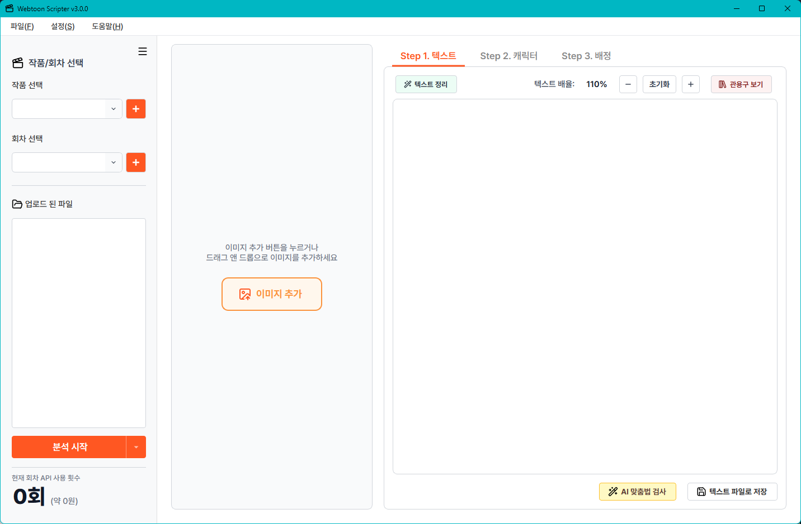
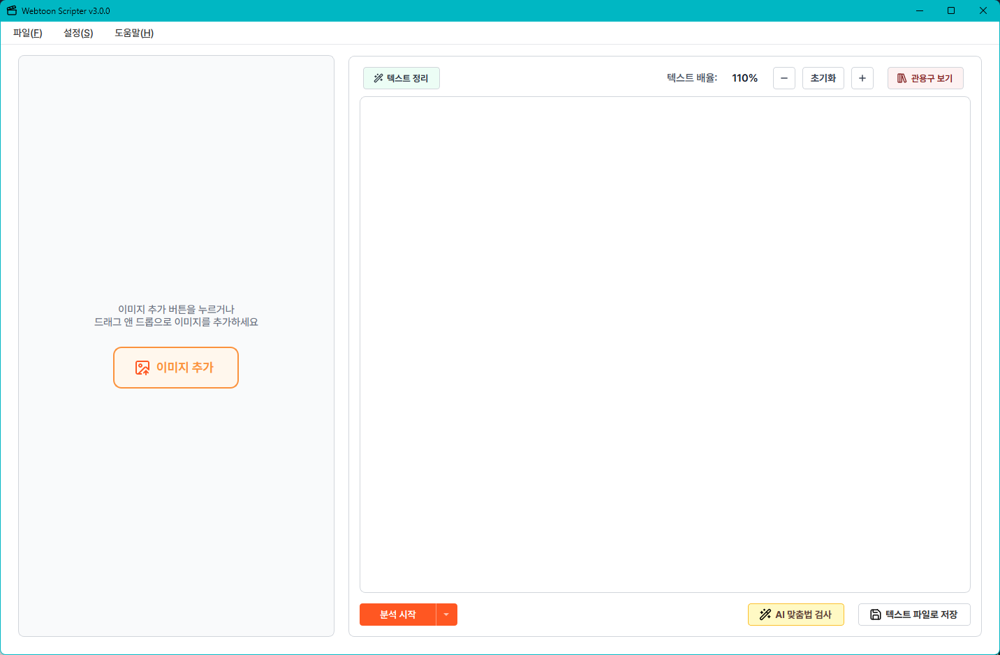
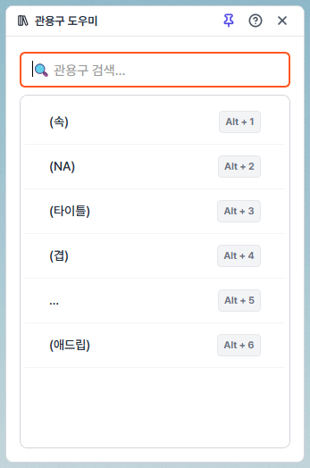
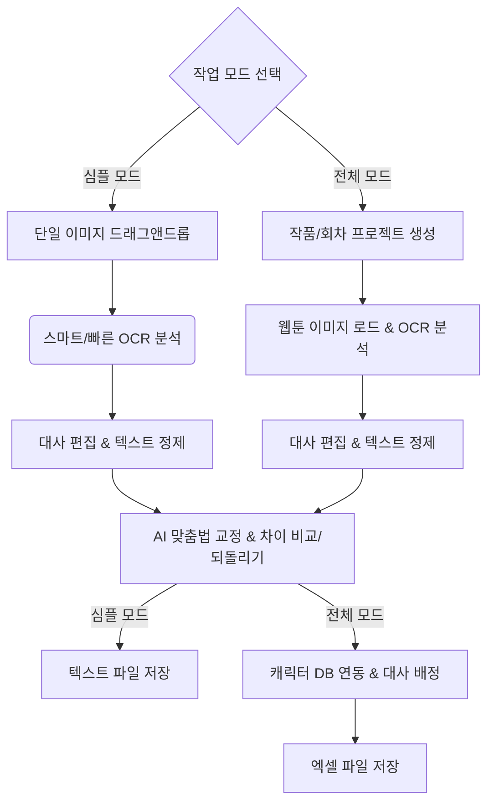

# 🎨 Webtoon Script Manager (v3.0)

[](https://www.python.org/)
[](https://doc.qt.io/qtforpython-6/)
[](https://deepmind.google/technologies/gemini/)
[](https://cloud.google.com/vision)

[📦 최신 윈도우 설치 파일 (.exe) 다운로드 바로가기](https://github.com/woo2koon/Webtoon-Scripter/releases/latest)

웹툰 대사 추출, AI 맞춤법 교정, 그리고 스크립트 작성 공정을 자동화하는 전문가용 저작 보조 도구입니다. 복잡한 워크플로우를 극적으로 단순화하여 작업 시간을 획기적으로 단축시킵니다.

## 📸 스크린샷 (Screenshots)

<table>
  <tr>
    <td align="center"><b>🖥️ 전체 모드 (Full Mode)</b></td>
    <td align="center"><b>⚡ 심플 모드 (Simple Mode)</b></td>
  </tr>
  <tr>
    <td></td>
    <td></td>
  </tr>
  <tr>
    <td align="center"><b>👥 캐릭터 도우미</b></td>
    <td align="center"><b>📚 관용구 도우미</b></td>
  </tr>
  <tr>
    <td></td>
    <td></td>
  </tr>
</table>

---

## 🔍 고도화된 분석 기능 (OCR 성능 강화)

### 1. ✂️ 분절 모드 (Segmentation Mode) 제공
* **스마트 모드:** 웹툰 컷 사이의 흰색 여백(경계면)을 스캔하여 지능적으로 이미지를 슬라이스합니다. 컷 내부의 글자가 절단선에 걸려 반으로 쪼개지는 현상을 방지합니다.
* **빠른 모드:** 일정한 픽셀 단위(`MAX_SLICE_HEIGHT`)로 고속 절단하여 분석 대기 시간을 최소화합니다.

### 2. 🚀 OCR 추출 능력 향상 기술 상세
구글 비전 API 호출 전후에 다양한 하이브리드 전처리 및 구조 분석 알고리즘을 추가하여 텍스트 인식 능력을 극대화했습니다.
* **LANCZOS 기반 2배 업스케일링:** 입력 이미지를 2배 선명하게 확대하여 해상도가 낮거나 크기가 작은 가독성 낮은 말풍선 대사의 인식률을 획기적으로 개선합니다.
* **하이브리드 명암/선명도 전처리:** 
  - **그레이스케일 변환 및 오토 콘트라스트(Cutoff 2%):** 불필요한 색상 정보 및 아웃라이어 픽셀 노이즈를 제거합니다.
  - **대비 증폭(1.8배) & 샤프니스 강화(2.0배):** 글자 외곽선의 경계를 뚜렷하게 강조하여 비정형 손글씨나 화려한 타이포그래피 대사도 놓치지 않고 캡처합니다.
* **정교한 말풍선 그룹화 (Hierarchical Merging):** 
  - 평균 글자 크기를 기준으로 상호 거리(X축/Y축) 및 오버랩 영역을 기하학적으로 연산하여 하나의 말풍선으로 유기 결합합니다.
* **스마트 대사 레이아웃 정렬 (Layout Sorting):** 
  - 세로 스크롤 방식의 웹툰 특성에 최적화된 Y축 정렬 방식뿐만 아니라, 좌우 배치 형태의 대화 배치도 정확한 흐름 순서(왼쪽 ➡ 오른쪽)로 정렬하는 커스텀 비교 알고리즘(`compare_metadata`)을 내장하고 있습니다.

## 🚀 생산성 강화 핵심 기능

### 1. ⚡ 심플 모드 (Simple Mode) 지원
* **드래그 앤 드롭 즉시 작업:** 복잡한 프로젝트 생성 절차 없이, 단일 웹툰 이미지를 드래그하여 즉시 대사를 추출하고 교정할 수 있는 쾌속 모드입니다.
* **빠른 내보내기:** 단일 회차나 임시 작업을 진행할 때 리소스 낭비 없이 핵심 기능만 컴팩트하게 활용 가능합니다.

### 2. 🤖 지능형 AI 맞춤법 교정 & 변경 시각화
* **문맥 기반 맞춤법 교정:** Google Gemini AI를 통해 웹툰 구어체와 줄바꿈 구조를 유지하면서 맞춤법을 정확하게 검사합니다.
* **변경 부분 실시간 시각화:** 맞춤법 검사 전/후의 텍스트 차이를 시각적(Diff)으로 대조하여 어떤 부분이 수정되었는지 바로 확인할 수 있습니다.
* **되돌리기(Undo) 지원:** AI 교정 결과가 마음에 들지 않거나 오교정이 발생한 경우, 클릭 한 번으로 손쉽게 원본 대사 상태로 되돌릴 수 있습니다.

### 3. 🧼 텍스트 정리 (Text Cleaner) 기능
* **불필요한 공백/줄바꿈 일괄 제거:** OCR 인식 과정에서 발생하는 불필요한 공백, 중복된 빈 줄, 특수 문자 노이즈 등을 스마트하게 정제합니다.
* **정리 전후 비교 다이얼로그:** 정제 전후의 데이터를 직관적으로 비교한 뒤 적용할 수 있어 원본 데이터를 안전하게 보호합니다.

### 4. 📚 관용구(지문) 도우미
* **자주 쓰는 지문/관용구 등록:** "[회상]", "[나레이션]" 등 빈번하게 사용되는 표현을 미리 등록하여 상시 관리할 수 있습니다.
* **스마트 삽입 및 단축키:** 플로팅 뷰어(`Ctrl+J`)를 띄워 마우스 클릭 한 번으로 활성 에디터에 삽입하거나, `Alt + [숫자]` 단축키를 통해 즉각적으로 지문을 입력할 수 있습니다.

### 5. 👥 캐릭터 DB & 데이터 마이그레이션
* **통합 캐릭터 관리:** 작품에 등장하는 캐릭터들의 이름, 역할, 성별, 연령 정보를 데이터베이스화하여 관리합니다.
* **이전 버전 마이그레이션 지원:** 기존 HTML 기반의 구버전 프로젝트 데이터를 파싱하여 최신 데이터 포맷으로 완벽하게 변환 및 마이그레이션할 수 있습니다.

### 6. 📊 스텝3 배정 탭 시트 (스프레드시트 에디터) 기능 강화
* **실행취소(Undo) & 다시 실행(Redo) 지원:** 시트 내 대사 수정 및 캐릭터 배정 등 작업 실수를 즉각 되돌리고(`Ctrl+Z`) 다시 실행(`Ctrl+Shift+Z`)할 수 있는 히스토리 백업 기능을 지원합니다.
* **캐릭터 드래그 앤 드롭 배정 (스텝2 생략):** 기존의 캐릭터 관리 단계(스텝2)를 거칠 필요 없이, 캐릭터 도우미 창에서 캐릭터 카드를 배정 시트로 끌어다 놓기(Drag & Drop)만 하면 자동으로 새 캐릭터가 생성되며 즉시 배정됩니다.
* **내용 합치기(셀 병합) & 내용 분리(셀 나누기):** 여러 행의 대사 텍스트를 하나로 결합(Merge)하거나 하나의 행에 들어있는 대사 문장을 원하는 지점에서 정교하게 분리(Split)하여 스크립트 분절 구조를 손쉽게 편집할 수 있습니다.
* **대사 순서 변경 (셀 이동):** 시트 내 대사 행의 순서를 위아래로 신속하게 이동시켜 대사가 표시되는 전후 맥락과 발화 순서를 자유롭게 조율할 수 있습니다.


## 🎨 사용자 경험(UX) 및 사용성 강화

### 1. 📂 드래그 앤 드롭 (Drag & Drop) 파일 업로드
* **직관적인 이미지 가져오기:** 파일 탐색기를 통해 파일을 번거롭게 찾는 대신, 웹툰 이미지 파일을 메인 작업 영역으로 드래그 앤 드롭하여 즉시 업로드하고 분석할 수 있어 작업 속도가 대폭 향상됩니다.

### 2. ⚡ 반응형 모션 및 비주얼 폴리싱
* **네이티브 반응 속도:** UI 프레임 레이트 저하를 유발하는 불필요한 레이아웃 애니메이션을 제거하고, 마우스 클릭과 전환에 즉각 응답하도록 최적화했습니다.
* **컴팩트 콤보박스 개선:** 드롭다운 콤보박스 클릭 시 간헐적으로 깜빡이거나 롱클릭해야 반응하던 버그를 해결하고 반응 영역을 확장했습니다.
* **유연한 화면 레이아웃 변경 (Resizing):** 원본 뷰어 영역과 대사 편집 시트 영역 간의 경계를 스플리터(Splitter) 드래그로 조절하여, 작업 공간을 작업자 해상도와 모니터 환경에 맞춰 가장 편리한 비율로 실시간 재구성할 수 있습니다.

### 3. 🔔 직관적인 피드백 시스템
* **토스트 알림 창:** 설정 저장, 작업 완료, 마이그레이션 결과 등 주요 실행 결과를 화면 방해 없는 부드러운 토스트 알림창으로 즉시 피드백합니다.
* **단축키 도우미:** 모든 유용한 단축키 조합을 보여주는 전용 도움말 모달을 지원하여 마우스 없이 신속하게 툴을 제어할 수 있도록 돕습니다.

### 4. 🗃️ 엑셀 자동 재저장 및 dubright(덥라이트) 호환성 보장
* **역할 표시 및 호환 문제 해결:** 사내 툴인 덥라이트(dubright) 업로드 시 역할이 제대로 표시되지 않는 문제를 수정했습니다. 엑셀 파일 저장 시 백그라운드에서 Microsoft Excel을 자동으로 실행해 재저장(Re-save) 공정을 수행함으로써, 인코딩 유실이나 오류 없이 대사 스크립트와 캐릭터 역할이 안정적으로 인식되도록 보장합니다.

### 5. 🗂️ 전체 모드 사이드바 토글 (닫기/열기)
* **작업 화면 공간 극대화:** 복잡한 사이드바 패널을 자유롭게 접고 펼 수 있어, 넓은 화면을 대사 시트 에디터 및 이미지 뷰어 영역으로 온전히 활용하여 작업 집중도를 높입니다.

### 6. 📂 고도화된 작품 및 프로젝트 파일 관리
* **원스톱 작품 제어:** 작품 및 회차관리 창에서 불필요한 작품 또는 특정 회차 데이터를 직접 삭제할 수 있습니다.
* **직관적인 컨텍스트 메뉴(우클릭) 지원:**
  - **프로젝트 폴더 이동:** 작업 폴더의 윈도우 탐색기 경로로 즉시 이동합니다.
  - **이미지 보기:** 대상 회차의 소스 이미지를 뷰어로 신속하게 확인합니다.
  - **텍스트/엑셀 파일 다운로드:** 분석 완료된 텍스트(.txt) 및 엑셀(.xlsx) 본을 원하는 로컬 경로로 즉각 내보낼 수 있습니다.

---

## 🔄 워크플로우 (Workflow)



---

## 🛠 기술 스택

* **Language:** Python 3.10+
* **UI Framework:** PySide6 (Qt6 for Python)
* **AI & OCR:** Google Cloud Vision API, Google Gemini AI
* **Data Processing:** Pandas, Openpyxl, Xlwings

---

## 📦 설치 및 실행 방법

### 💻 일반 사용자 실행 (윈도우 설치형)
* **[📦 최신 윈도우 설치 파일 (.exe) 다운로드](https://github.com/woo2koon/Webtoon-Scripter/releases/latest)**
* 위 링크를 클릭하여 다운로드된 `Webtoon_Scripter_v3.0_Setup.exe` 파일을 실행해 안내에 따라 설치하시면, 바탕화면 바로가기 아이콘을 통해 즉시 실행하실 수 있습니다.

---

### 🛠️ 개발자 환경 실행 (소스 코드 직접 실행)

1. **의존성 설치**
   ```bash
   pip install -r requirements.txt
   ```

2. **프로젝트 실행**
   ```bash
   python main.py
   ```

3. **API 설정**
   * 프로그램 실행 후 `파일` > `설정` 메뉴에서 Google Cloud Vision API Key 및 Gemini API Key를 올바르게 등록해야 OCR 및 AI 맞춤법 교정 기능이 활성화됩니다.

4. **구버전 데이터 마이그레이션**
   * 도움말 메뉴의 `이전 버전 데이터 가져오기 (마이그레이션)`를 선택하여 안내에 따라 구버전 프로젝트 폴더/파일을 불러올 수 있습니다.

---

## 📝 라이선스

이 프로젝트는 개인 및 팀의 웹툰 스크립트 추출 공정의 생산성 향상을 위해 개발되었습니다. 상세 라이선스는 리포지토리 규정을 따릅니다.
