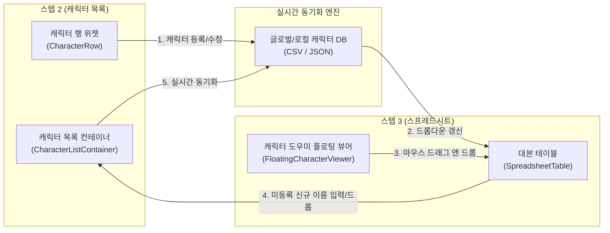

# 👥 스텝 2 & 스텝 3 하이브리드 캐릭터 양방향 연동 및 드래그 앤 드롭 구현 계획서

본 계획서는 **스텝 2(캐릭터 설정 및 목록)**와 **스텝 3(대본 스프레드시트 편집)**을 유기적으로 연동하여, 이미 구축된 캐릭터 도우미 창에서 마우스 드래그만으로 대본 역할 셀을 지정하고, 신규 입력된 역할은 실시간으로 캐릭터 목록에 역류 동기화되는 **지상 최고의 하이브리드 양방향 연동 엔진**을 수립하기 위한 정밀 개발 로드맵입니다.

---

## 1. 핵심 아키텍처 및 연동 시나리오

### 🔄 양방향 연동 흐름
1. **정방향 (Step2 ➔ Step3)**: 스텝 2나 글로벌 캐릭터 설정에서 캐릭터를 새로 만들거나 수정하면, 스텝 3의 역할명 콤보박스(드롭다운) 리스트와 스텝 3용 캐릭터 도우미 창이 실시간으로 갱신됩니다.
2. **역방향 (Step3 ➔ Step2)**: 스텝 3 스프레드시트 역할 셀에 **미등록된 완전히 새로운 캐릭터 이름**을 드롭하거나 키보드로 직접 입력해 셀 수정을 완료하는 순간, 동기화 엔진이 이를 가로채어 **스텝 2 캐릭터 목록에 실시간 자동 등재 및 저장** 처리합니다.

---

## 2. 모듈별 상세 구현 계획

### 🛫 [Part 1] 드래그 시작점 개발: 캐릭터 도우미 카드 개조
*   **대상 파일**: [widgets.py](file:///e:/호작질/Webtoon_OCR_mac_260430_로컬 방식 고안/widgets.py) 내 `CharacterCard` (도우미 창 내부의 카드 위젯)
*   **구현 내용**:
    *   `mousePressEvent` 및 `mouseMoveEvent` 오버라이딩을 통한 Qt 드래그 조작 개시.
    *   **MIME 데이터 바인딩**: `QMimeData`에 캐릭터 이름 문자열(`self.char_name`)을 투명하고 견고하게 안착.
    *   **미니 아바타 픽스맵 드래그 효과**: 캐릭터 카드가 품고 있는 둥근 얼굴 아바타 이미지를 투명도 `0.7`, 스케일 `50x50px` 크기의 둥근 사각형 픽스맵 이미지로 동적 드로잉하여 마우스 포인터 밑을 자연스럽게 따라다니는 초호화 비주얼 연출.

### 🛬 [Part 2] 드롭 목적지 개발: 스프레드시트 드롭 엔진 장착
*   **대상 파일**: [widgets.py](file:///e:/호작질/Webtoon_OCR_mac_260430_로컬 방식 고안/widgets.py) 내 `SpreadsheetTable`
*   **구현 내용**:
    *   `self.setAcceptDrops(True)` 수용 선언.
    *   `dragEnterEvent`: drag로 끌고 들어온 데이터에 텍스트(`hasText()`)가 포함되어 있는지 검증하고 수용.
    *   `dragMoveEvent` (정밀 타겟팅 필터) : 마우스 커서 아래에 있는 셀의 열(Column)을 실시간 감지하여, 오직 **"역할" 입력 열(일반적으로 2번째 Column)** 일 때만 드롭 복사(`CopyAction`) 포인터로 승인하고, 대사 칸이나 번호 칸 같은 엉뚱한 열은 빨간색 거부 표시로 원천 차단.
    *   `dropEvent`: 마우스가 역할 셀 위에 떨어지는 순간, 드래그 해 온 캐릭터 이름을 해당 셀의 텍스트로 즉시 기입하고, 스프레드시트의 셀 변경 이벤트를 실시간 방출.

### 🔄 [Part 3] 실시간 양방향 역류 동기화 엔진 구축
*   **대상 파일**: [main.py](file:///e:/호작질/Webtoon_OCR_mac_260430_로컬 방식 고안/main.py) 내 스텝 3 데이터 변경 감지 콜백 (`on_table_data_changed` 등)
*   **구현 내용**:
    *   스프레드시트의 역할 열의 값이 수정(드래그앤드롭 안착 혹은 사용자의 키보드 입력 완료)될 때:
        1.  입력된 문자열(예: `"라헬"`)을 공백 트리밍 정리.
        2.  현재 스텝 2의 캐릭터 목록 컨테이너(`CharacterListContainer`)와 기존 로컬 캐릭터 데이터베이스에 존재하는 이름인지 검사.
        3.  만약 존재하지 않는 **신규 이름**일 경우:
            - 스텝 2 캐릭터 목록에 새 캐릭터로 즉시 등록 처리 (`add_character_row("라헬")`).
            - 성별, 나이, 역할군 등은 디폴트 비지정 값으로 안전하게 채움.
            - 새로 생성된 스텝 2 캐릭터 목록을 디스크(`character_info.csv`)에 즉시 자동 저장하여 데이터 유실 원천 방지!
            - 스텝 3의 역할명 콤보박스 풀에도 이 신규 캐릭터가 실시간 즉각 합류되도록 콤보박스 위젯 전체 갱신 호출.
            - 화면 하단에 은은하고 세련된 토스트 메시지 출력: `"👥 새 캐릭터 '라헬'이 작품 캐릭터 목록에 실시간 추가되었습니다."`

### 🛠️ [Part 4] 스텝 3 도구 상자에 '도우미 가동' 조작 세트 상시 전면 배치
*   **대상 파일**: [main.py](file:///e:/호작질/Webtoon_OCR_mac_260430_로컬 방식 고안/main.py) 내 스텝 3 탭 레이아웃 영역
*   **구현 내용**:
    *   현재 스텝 2 화면의 우측에만 독점 제공되던 **"작품 캐릭터 보기(사람 SVG)"** 및 **"캐릭터 설정(톱니바퀴 SVG)"** 버튼을 스텝 3 화면의 툴바/상단 영역에도 대칭적이고 정갈하게 추가 배치!
    *   이를 통해 진우님이 스텝 3 대본 수정 작업을 진행하는 도중에도 마우스 클릭 단 한 번으로 플로팅 캐릭터 도우미 창을 가볍게 호출하여 띄워 놓고, 곧바로 역할 셀로 아바타 드래그 앤 드롭 매직을 실행할 수 있도록 물리적 도구를 선사합니다.

---

## 3. 세부 개발 및 검증 단계

| 단계 | 개발 업무 범위 | 기대 성과 및 시각 효과 |
|---|---|---|
| **Phase 1** | **아바타 픽스맵 마우스 트래킹 구현** | 캐릭터 카드 드래그 시, 투명하고 깜찍한 프로필 미니미 아이콘이 마우스를 부드럽게 졸졸 추적하는 비주얼 피드백 안착 |
| **Phase 2** | **스프레드시트 타겟팅 드롭 이식** | 마우스가 역할 셀 위에 있을 때만 드롭을 허용하고, 마우스를 떼는 순간 딜레이 없이 셀 텍스트에 이름이 자석처럼 착 달라붙는 조작 완성 |
| **Phase 3** | **실시간 역류 동기화 및 CSV 자동 저장 수립** | 드롭/입력된 신규 캐릭터가 스텝 2 목록에 자동으로 등재 및 디스크 저장되며, 스프레드시트 콤보박스 풀이 실시간 숨쉬듯 연동 갱신 |
| **Phase 4** | **스텝 3 상단 컨트롤러 버튼 추가** | 스텝 3 환경에서도 자유롭게 도우미 창과 설정 창을 부르고 끌 수 있는 대칭 UI 완성 |

---

진우님! 본 구현 계획서의 설계 및 계획을 검토해 보신 후 승인해 주시면, 단 1px of error 없이 극상의 퀄리티로 하이브리드 양방향 연동 마법을 즉시 구축하겠습니다! 🚀🔥🎨
